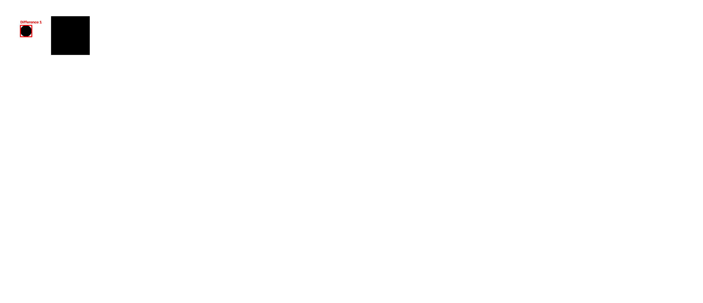

# Image Compare Studio

A simple Computer Vision project built with Python and OpenCV.

The application compares two images, detects visual differences, highlights them with red rectangles, and saves the processed images.

---

## Features

- Load two images
- Verify that both images exist
- Verify image sizes
- Compute image difference
- Convert difference to grayscale
- Apply binary threshold
- Detect contours
- Filter small contours by area
- Draw bounding rectangles
- Label detected differences
- Save processed images

---

## Technologies

- Python 3
- OpenCV
- NumPy

---

## Project Structure

```
image_compare_studio/
│
├── data_in/
│   ├── image1.png
│   └── image2.png
│
├── data_out/
│   ├── difference.png
│   ├── gray_difference.png
│   ├── threshold_difference.png
│   └── result_with_rectangle.png
│
├── main.py
├── requirements.txt
└── README.md
```

---

## Installation

Clone the repository:

```bash
git clone https://github.com/Sen2x/image_compare.git
```

Go to the project:

```bash
cd image_compare
```

Install dependencies:

```bash
pip install -r requirements.txt
```

---

## Run

```bash
python main.py
```

---

## Output

The program generates:

- difference.png
- gray_difference.png
- threshold_difference.png
- result_with_rectangle.png

inside the `data_out` directory.

---

## Example Workflow

1. Load two images.
2. Compare them using OpenCV.
3. Detect changed regions.
4. Draw rectangles around differences.
5. Save the result.

---

## Future Improvements

- Command-line arguments
- GUI
- Support for different image sizes
- Noise reduction
- Morphological operations
- Better contour filtering

---

## Author

Arsenijs Senins

## Result

